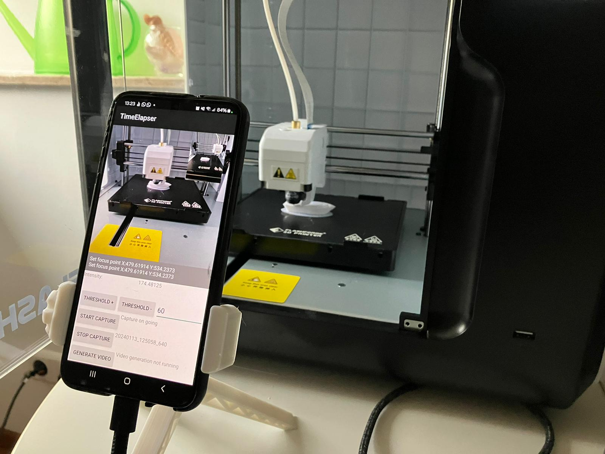

# Time Lapse for Flashforge "Adventurer 3" 3D Printer with an Android Smartphone

## Applications and Scripts

1. **Main Application for Android Smartphone**
   - Implemented in Android Studio with Kotlin
   - Integrated FFmpeg for video generation and OpenCV for image processing

2. **Python Script to Patch G-code of 3D Printer**: 
   - 3dprinterskript/3delapser.py

## How to Use

### Application
- The application monitors the camera preview and detects when the printer bed reaches the front of the printer, in order to trigger a picture capture.
- This is achieved by comparing a simple threshold of the average intensity of the bottom part of the image. When the black printer bed arrives at the front, the intensity decreases to a level below a set threshold. You shall position your smartphone and adjust the threshold, for optimal triggering, although the default values works normally fine.
- To set the focus of your camera, just tip on the screen to set the focus point. It is very important to set the focus point correctly before starting capture, so take time to do it right.
- To start capturing picture, press the "Start capture" button. Capture status is shown in the status field. Last captured picture is shown for control on top right of the screen.
- To generate the video, stop the picture capture first with corresponding button, then press "generate video" button and wait for ready video compilation, which can take several time, depending on the number of pictures.
- Captured pictures and video are stored in separate directories under the DCIM directory on the smartphone, allowing video compilation outside the smartphone for additional processing possibilities.

#### Possible adjustments:
- Threshold: Threshold to trigger picture captured, based on the average intensity of the bottom part of the image.
- Debounce Time 1: Delay \[ms\]  between bed arrival and picture capture 
- Debounce Time 2: Blocking time \[ms\] for capturing pictures after a picture was captured.

### G-code patcher
- Slice your 3D model with Flashprint and save as \<model name\>.gcode
- Patch with: 
   - python 3delapser.py \<model name\>.gcode
   - The Python script patches the G-code to bring the printer bed to the front after each layer is printed. The camera head is positioned on the back and right of the printer.
- Load the patched file \<model name\>_mod.gcode in Flashprint and print

## First Results

**New video, see the new improved result !!!**: [YouTube Link](https://youtube.com/shorts/u1YLS9d8Gzg?si=WoZzKgy8dSzSu5VT)

First video (old): [YouTube Link](https://youtube.com/shorts/npaiBbHT8cs?si=XNsPOFgp2joKy5DW)

## How and Why This Project Started

During my recent vacation, I wanted to explore how well OpenAI ChatGPT could assist in software implementation. Despite having many years of experience in embedded software development (especially in C), I had no knowledge of Android Studio, Kotlin, Gradle, and Android development. Additionally, I was unfamiliar with how G-code works for 3D printers. I decided to take on the challenge and see if I could create a functional application with the assistance of ChatGPT. Surprisingly, it worked!

# Description of Main Module `CameraActivity.kt`

The `CameraActivity` class is the main activity of the TimeLapser Android application, responsible for camera preview, picture capturing, video compilation, and bed arrival detection. Below is a breakdown of its structure and functionality.

## Dependencies and Imports

The activity imports necessary Android and third-party libraries, including OpenCV and FFmpeg.

## Properties

- `timeStampvid`: String - Timestamp used for naming video files.
- `camera`: Camera - Represents the device camera.
- `surfaceView`: SurfaceView - Provides a dedicated drawing surface for the camera preview.
- `surfaceHolder`: SurfaceHolder - Manages the surface of `surfaceView`.
- `grayImageView`: ImageView - Displays grayscale images.
- `rgba`: Mat - OpenCV matrix for RGBA color space.
- `gray`: Mat - OpenCV matrix for grayscale images.
- `logTextView`: TextView - Displays log messages.
- `ffmpeg`: FFmpeg - Manages FFmpeg functionality.
- `cameraPermissionCode`: Int - Permission code for camera access.
- `pictureNumber`: Int - Tracks the number of captured pictures.
- `lastTriggerTime`: Long - Records the timestamp of the last trigger event.
- `triggerAvailable`: Boolean - Flag indicating if a trigger event is available.
- `debounceTime1`: Long - Configurable debounce time for trigger events.
- `debounceTime2`: Long - Configurable debounce time for preventing rapid triggers.
- `videoProcOngoing`: Boolean - Flag indicating if video compilation is in progress.

## `onCreate` Method

- Initializes OpenCV.
- Sets up UI elements and permissions.
- Initializes timestamp and starts camera preview.

## `onKeyDown` Method

- Handles volume key events for picture capturing and video compilation.

## `compileVideo` Method

- Compiles images into a video using FFmpeg.
- Uses coroutine for asynchronous execution.

## `createOutputVideoPath` Method

- Generates the output path for the compiled video.

## `capturePicture` Method

- Captures a picture using the camera.
- Calls `savePicture` and restarts the camera preview.

## `savePictureAsync` Method

- Saves the captured picture asynchronously.

## `savePicture` Method

- Calls `savePictureAsync` on the main thread.

## `getOutputMediaFile` Method

- Creates and returns the output file for saved pictures.

## `startCameraPreview` Method

- Initializes and starts the camera preview.
- Configures camera parameters, preview size, and focus modes.
- Sets touch focus listener on the `SurfaceView`.
- Sets the preview callback for frame processing.

## `setCameraDisplayOrientation` Method

- Sets the display orientation of the camera based on device rotation.

## `stopCameraPreview` Method

- Stops and releases the camera preview.

## `setCameraZoom` Method

- Sets the camera's focus mode and zoom level.

## `handleTouchFocus` Method

- Handles touch events for setting the focus area.
- Uses camera parameters to set focus areas and metering areas.
- Calls auto focus to apply changes.

## `calculateFocusRect` Method

- Converts touch coordinates to camera coordinates.
- Calculates a focus area rectangle.

## `configureCameraPreviewSize` Method

- Configures the camera preview size based on desired dimensions.

## `findBestPreviewSize` Method

- Finds the closest supported preview size to the desired size.

## `surfaceCreated` Method

- Initializes OpenCV matrices
